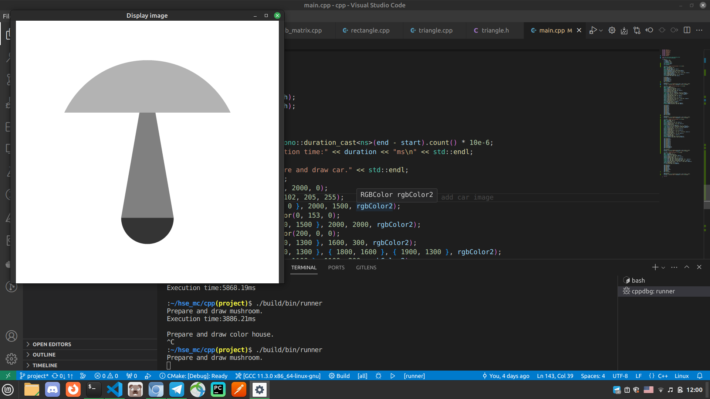
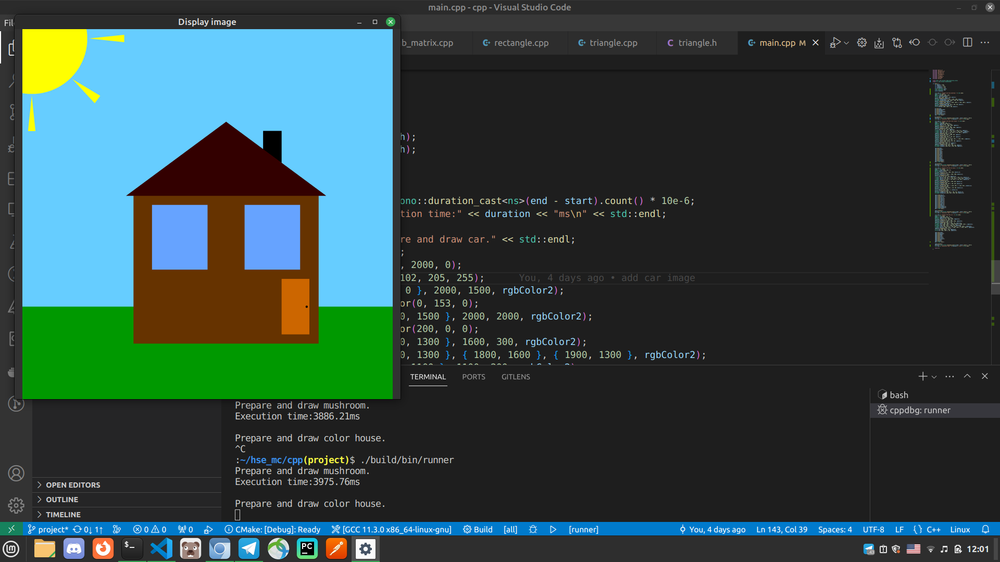
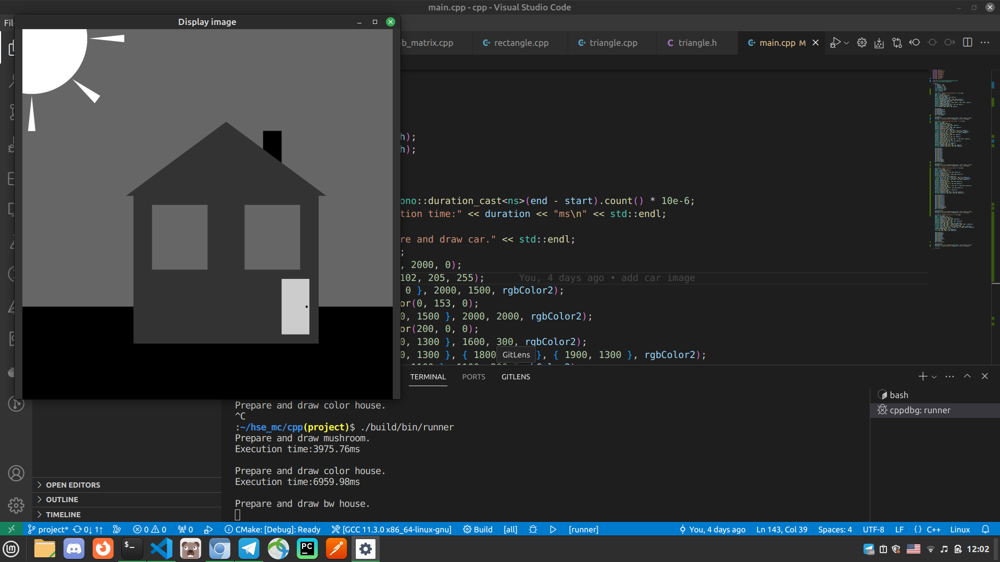
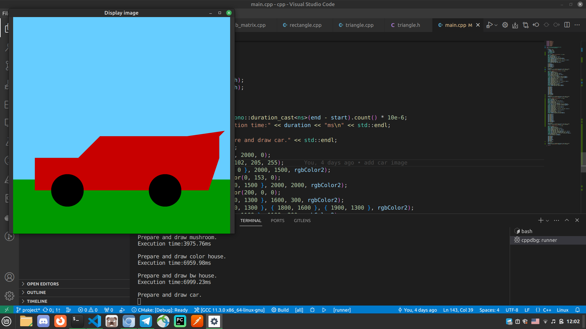
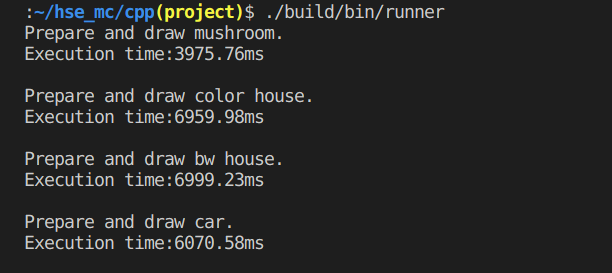

## HSE CPP cource

Final cource project

### Description

Implement basic class Shape, and subclasses: Rectangle, Triangle, Circle.
Implement Matrix::draw(Shape&) method, which fill matrix by shape's pixels.
if pixel is out of the matrix bound, this pixel is skipping while drawing shape at matrix.

### Requirements
- compiler with C++17 features
- cmake
- OpenCV

### Building
```bash
$ mkdir build && cd build
$ cmake ..
$ make -j4
```

### Project structure
- `include` - contains classes definitions.
- `images` - contains sample HSE logo images.
- `src` - contains classes implementations.
- main.cpp - contains main function

### Run the programs
Program runs without any  attributes.
Program draws tree pictures: bw mashroom, bw house, color house and color car. Press any button to draw next picture.
Drawn pictures can be stretched.

Example of execution program with command line:
```bash
./build/bin/runner
```
Program writes perfomance time to terminal.

### Examples

Picture appears in small size, you can stretch it.
After run programm you can see first picture:


Press any button and see next picture:


Press any button and see next picture:


Press any button and see next picture:


Then you can see perfomance in the terminal:

